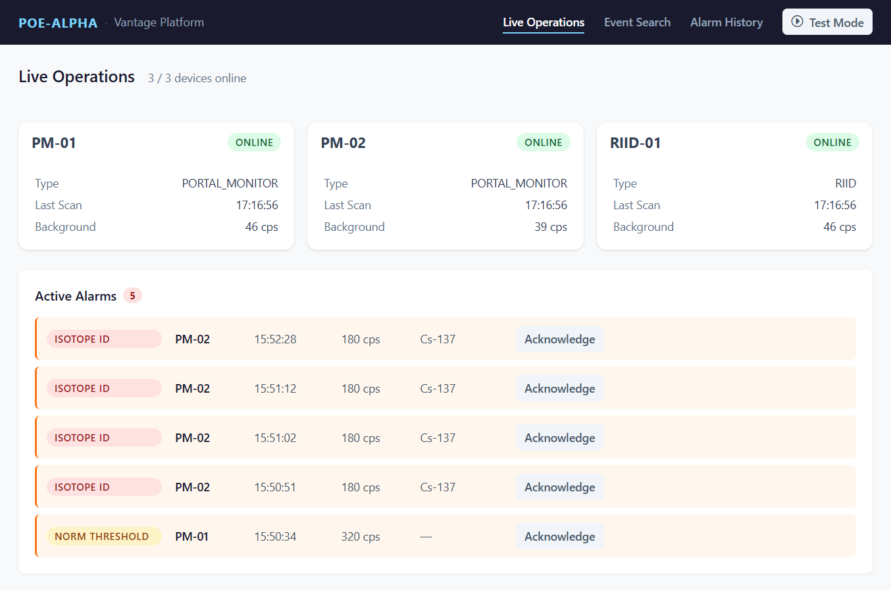
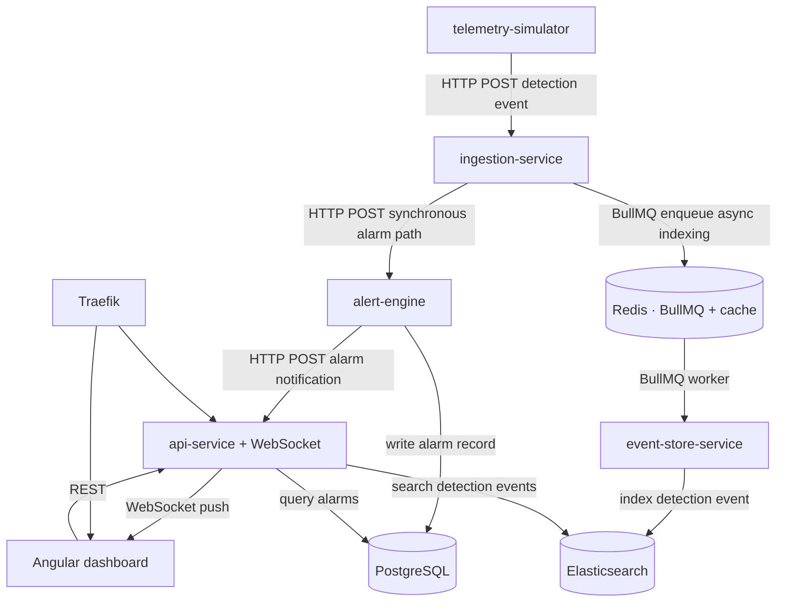

# Vantage Platform Demo

[](https://github.com/ApeOnFire/c2-threat-detection/actions/workflows/ci.yml)

A working microservices platform on K3s, modelling the architecture of a radiation detection command-and-control system for government border security. Six TypeScript services, three data stores (PostgreSQL, Redis, Elasticsearch), an Angular operator dashboard, Prometheus and Grafana for observability, deployed via Helm on Rocky Linux 9 with a GitHub Actions CI/CD pipeline.

**Architectural goals**

- The alarm path fails loudly and immediately if any component is unavailable — silent degradation is the wrong failure mode for safety-critical notification.
- Every detection event is durably recorded regardless of alarm status, with idempotent retry protecting against transient storage failures.
- The alarm evaluation path carries no runtime dependency on the indexing infrastructure; neither path can degrade the other.
- Alarm rules propagate to the evaluation service without a restart.

I formed a view of what a radiation detection C2 platform probably looks like, working from technology choices in a job specification and publicly available product information, then built a working version to test that view. The inference could be wrong in several places. This README describes what I built, the reasoning behind it, and where I'd welcome correction.

The platform simulates the architecture, not the domain. Detection events come from a telemetry simulator with injectable scenarios; there are no real radiation measurements, no spectral analysis, and no isotope identification algorithms. The service boundaries, communication patterns, data flow, and observability instrumentation are the real subject.



---

## Architecture



### Services

| Service | Role | Why it's a separate service |
|---|---|---|
| `telemetry-simulator` | Simulates three detection devices — two portal monitors (`PM-01`, `PM-02`) and one handheld RIID (`RIID-01`) — emitting detection events and heartbeats. Exposes a scenario injection API for test mode. | Isolated from the platform services so it can be replaced without affecting anything downstream. In production this is real device traffic over real device protocols. |
| `ingestion-service` | Normalisation layer. Validates and canonicalises inbound detection events, then routes: (1) synchronous HTTP POST to `alert-engine`, (2) async BullMQ enqueue for Elasticsearch indexing. | The normalisation concern is separate from alarm evaluation and from storage. A heterogeneous device estate — multiple vendors, multiple modalities — must be translated into a canonical schema here, once, so every downstream service consumes only the canonical form. |
| `alert-engine` | Evaluates each detection event against configured alarm rules (loaded from PostgreSQL, cached in-process, hot-reloaded via `LISTEN/NOTIFY`). Returns result synchronously to `ingestion-service`. Writes alarm records to PostgreSQL and notifies `api-service` on alarm condition. | The safety-critical path. Isolated in its own container with its own failure domain. No Redis dependency, no Elasticsearch dependency. If the entire indexing pipeline fails, alarm evaluation is unaffected. |
| `event-store-service` | BullMQ worker. Consumes the `detection-events` queue and indexes each event to Elasticsearch with retry (3 attempts, exponential backoff). | Decoupled from the alarm path by design. The more important point is what gets indexed: every detection event, regardless of alarm status. In a government deployment context, the expectation is that every subject can be accounted for — the absence of an alarm is itself a data point. Elasticsearch falling behind causes delayed indexing, not missed alarms; retry is appropriate here because the wrong failure mode is data loss, not latency. |
| `api-service` | REST API and WebSocket server. Reads alarms from PostgreSQL, detection events from Elasticsearch, device state from Redis. Receives alarm notifications from `alert-engine` via an internal endpoint and broadcasts to connected WebSocket clients. | Mediates all dashboard access to the three data stores. Keeps the operator interface decoupled from the storage layer and prevents direct frontend access to Elasticsearch. |
| `dashboard` | Angular 21 operator interface. Live Operations view (active alarms via WebSocket, device status cards), Detection Event Search (Elasticsearch-backed audit trail), Alarm History, and a Test Mode panel for scenario injection. | Served as a separate Deployment — the operator interface has no business logic and scales independently. |

The point worth stating explicitly: **`alert-engine` shares no process with `event-store-service`.** The alarm path (`ingestion-service` → `alert-engine` → `api-service` → WebSocket) is synchronous HTTP throughout. The indexing path (`ingestion-service` → Redis/BullMQ → `event-store-service` → Elasticsearch) is fully async. Elasticsearch indexing falling behind does not affect alarm evaluation or real-time alarm delivery.

---

## Technology decisions

**Direct HTTP on the alarm path, not a message broker.** If `alert-engine` is unreachable, `ingestion-service` returns 503 immediately. That is the correct failure mode for a safety-critical path: loud and immediate, not silent queueing. Kubernetes replicas handle `alert-engine` HA; a broker between ingestion and alarm evaluation would add latency and obscure failures.

**BullMQ on the indexing path.** Detection event indexing tolerates latency and benefits from retry. If Elasticsearch is briefly unavailable, jobs queue and retry with exponential backoff. BullMQ is Redis-backed (no additional dependency) and idiomatic TypeScript.

**PostgreSQL `LISTEN/NOTIFY` for alarm rule hot-reload.** Alarm rule changes propagate to `alert-engine` via a PostgreSQL notification channel. The service re-queries the rules table on notification without restarting. Native PostgreSQL mechanism, no additional infrastructure.

**Helm values profiles.** `values.yaml` is the base: all six services, all three data stores, Prometheus, Grafana. `values-production.yaml` overlays it with the `ghcr.io` image repositories used in production — this is what the CI/CD deploy pipeline applies. `values-central.yaml` bumps resource allocations for the observability stack (Elasticsearch memory, larger persistent volumes) for deployments on more capable hardware.

**TypeScript throughout.** Single language across all services and the shared `packages/types` package. The `DetectionEvent` interface and its payload types are defined once and imported by every service that touches them, with no schema drift across the service boundary.

**Vitest for alarm rule evaluation tests.** The `alert-engine` evaluator is structured as a pure function: `DetectionEvent` + alarm rules in, evaluation result out. No database, no network. Structuring the safety-critical path as a pure function is an architectural decision: it makes the evaluation logic deterministic and testable in isolation regardless of what surrounds it. The ingestion-service alarm path ordering test uses `msw` to intercept the HTTP call to `alert-engine` without a running service.

**K3s, not minikube.** K3s is production-grade and appropriate for edge deployments; minikube is explicitly a developer tool. The same Helm charts that run here deploy to a production cluster unchanged, with no environment-specific build artefacts.

**Traefik ingress.** K3s ships Traefik v3 by default. `kubernetes/ingress-nginx` reached end-of-life in March 2026. Traefik handles WebSocket natively — no annotation workarounds required.

**Rocky Linux 9.** RHEL-family OS, chosen for the government deployment context. Air-gapped border installations are likely running RHEL or a compatible derivative; the choice signals awareness of that environment rather than convenience.

**No cloud-managed services.** All three data stores run in-cluster as standard Deployments backed by PersistentVolumeClaims, using official upstream images. This mirrors an air-gapped on-prem deployment model where no cloud-managed services are available.

**Prometheus and Grafana as separate lightweight charts.** `kube-prometheus-stack` is too resource-heavy for a single-node demo. Prometheus installed via `prometheus-community/prometheus`; Grafana via `grafana/grafana`. Four dashboards provisioned as configmap-backed JSON: they load automatically on deployment and are version-controlled in the repo under `helm/vantage-demo/dashboards/`.

**GitHub Actions CI/CD.** On every push: `tsc --noEmit`, ESLint, Vitest, and Docker build. On merge to master: Docker images built and pushed to `ghcr.io` tagged with `sha-{git SHA}`, then deployed to EC2 via `helm upgrade --values values-production.yaml --set global.imageTag=sha-{git SHA}`. The same Helm chart that runs in CI deploys to the live instance.

Each decision above has a corresponding record in [docs/adr/](docs/adr/) — nine ADRs covering the key trade-offs in more detail.

---

## Running it

Prerequisites: a K3s cluster, `helm` and `kubectl` configured.

```bash
helm install vantage-demo helm/vantage-demo
```

For local development without a cluster, see [docs/plans/phase-9-local-k3s.md](docs/plans/phase-9-local-k3s.md).

### Test Mode

The dashboard's Test Mode panel injects scenarios via the simulator. The equivalent curl commands (replace `<host>` with the live IP or `localhost:3004` locally):

| Scenario | What it does |
|---|---|
| `norm-threshold` | PM-01 emits a high count-rate event; `alert-engine` raises a `NORM_THRESHOLD` alarm |
| `isotope-identified` | PM-02 emits a Cs-137 event; `alert-engine` raises an `ISOTOPE_IDENTIFIED` alarm |
| `concurrent` | PM-01 and PM-02 alarm simultaneously — tests concurrent WebSocket broadcast |
| `device-offline` | PM-01 heartbeats suppressed for 45 s; device status card transitions to OFFLINE then recovers automatically |

```bash
curl -X POST http://<host>/api/scenarios/norm-threshold
curl -X POST http://<host>/api/scenarios/isotope-identified
curl -X POST http://<host>/api/scenarios/concurrent
curl -X POST http://<host>/api/scenarios/device-offline
```

---

## Production HA equivalents

The architectural decisions are the same in production. What changes is resilience, not structure.

| Demo simplification | Production equivalent | Why it doesn't affect the architectural argument |
|---|---|---|
| Single-node K3s | Multi-node cluster: 3 control plane nodes (distributed etcd), N workers. Same Helm charts, different `values.yaml`. | Service isolation, communication patterns, and data store roles are identical. |
| Single `alert-engine` replica | 2–3 replicas behind a ClusterIP Service with liveness/readiness probes. K8s routes around failed pods during restart. | The architectural point — alarm path isolation — is demonstrated by the service boundary, not by replica count. |
| Single PostgreSQL instance | Streaming replication (primary + read replica) + PgBouncer for connection pooling. | `alert-engine`'s in-process rule cache means a brief PostgreSQL outage doesn't break alarm evaluation — only alarm record persistence is affected. |
| Single Redis instance | Redis Sentinel (3 nodes) for automatic failover. | Redis going down affects the BullMQ indexing queue and the device state cache. The alarm path is synchronous HTTP — it has no Redis dependency and is unaffected. |
| Single Elasticsearch node | 3-node cluster with dedicated master nodes. | BullMQ retry means a brief Elasticsearch outage causes delayed indexing, not data loss. The alarm path is unaffected. |
| No inter-service TLS | mTLS via cert-manager or a service mesh (Istio/Linkerd). | Required for SC-cleared government deployments; out of scope for a demo running on a single EC2 instance. |

The Redis and PostgreSQL rows carry the most signal. Redis HA matters for indexing durability; it does not matter for alarm evaluation, because the alarm path has no Redis dependency. PostgreSQL HA matters for alarm record persistence; it does not affect real-time evaluation, because `alert-engine` caches rules in-process. These are not implementation details; they are consequences of how the service boundaries are drawn.

---

## What's not here

Known omissions, and what production would use:

- **Authentication and RBAC.** OIDC for operator identity; certificate-based device identity for SC-cleared deployments. The demo runs without auth.
- **MQTT device protocol.** HTTP POST stands in for device-to-platform telemetry. MQTT is the standard protocol for constrained IoT devices (low bandwidth, intermittent connectivity, lightweight clients). The `ingestion-service` normalisation layer is where protocol translation would live.
- **Real isotope identification.** The simulator emits pre-classified events. Server-side isotope classification is a core proprietary capability of this class of platform; it is not implemented here and not inferred in any detail.
- **Multiple detection modalities.** The event envelope (`eventType`, typed `payload`) supports `XRAY_SCAN` and `CBRN_DETECTION` alongside `RADIATION_SCAN`. Only `RADIATION_SCAN` / `RadiationPayload` is implemented. The schema makes the extension pattern legible without requiring the pipelines to be built.
- **Alertmanager.** Prometheus and the four Grafana dashboards are present. Automated paging on P99 `alert_engine_evaluate_duration_seconds` and BullMQ queue depth thresholds is not wired up.
- **Log aggregation.** Services emit structured JSON to stdout. `kubectl logs` is sufficient for the demo; production would ship to a centralised store.

The architecture is built from inference, not inside knowledge. Several of the decisions above could be wrong, or right for the wrong reasons. If you're reading this and can correct any of it, that conversation is the point.
